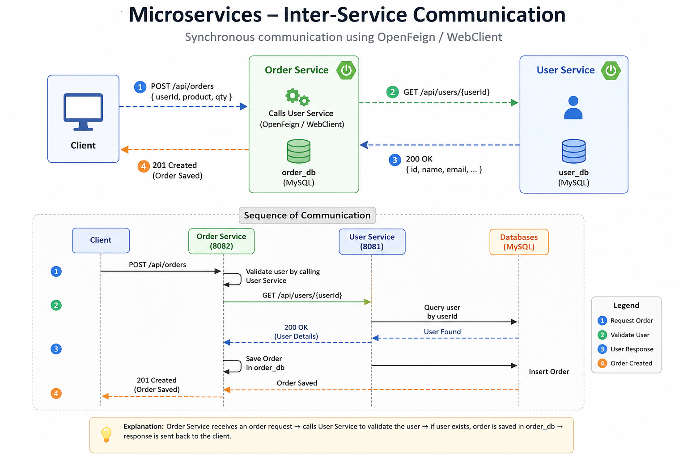
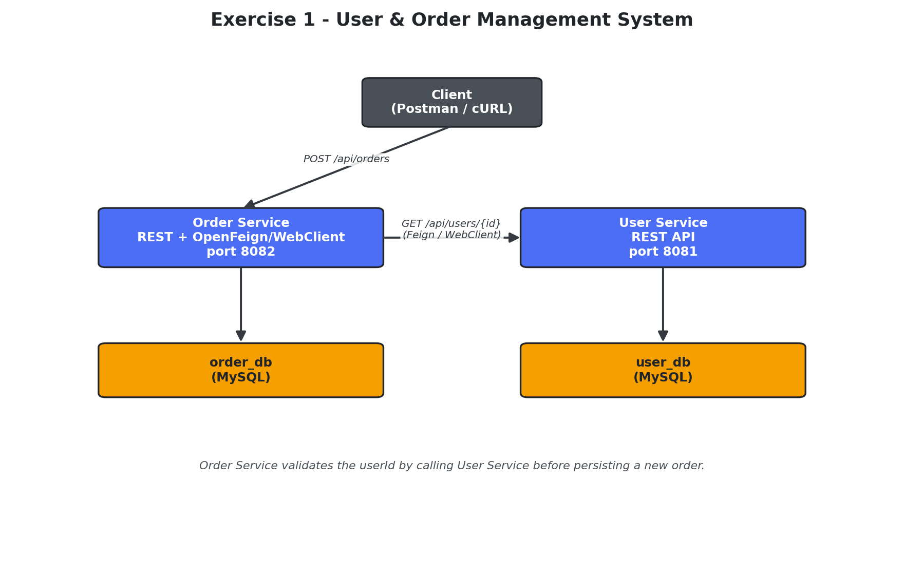
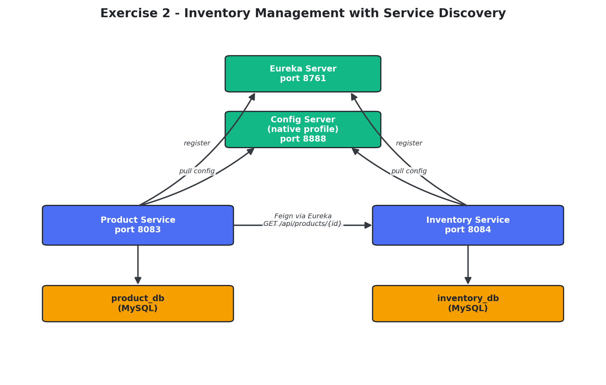
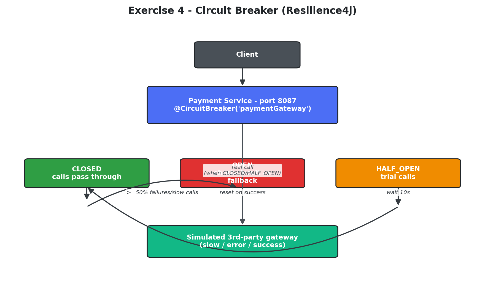

# 🚀 Spring Boot 3 Microservices Learning Repository

> A comprehensive collection of hands-on microservices projects built using **Spring Boot 3** and the **Spring Cloud** ecosystem. This repository demonstrates modern distributed application development through real-world implementation of service communication, discovery, API Gateway, centralized configuration, and fault tolerance.

---

## 📖 About

This repository contains multiple independent projects designed to explore the fundamental building blocks of a Microservices Architecture.

Each module focuses on one important concept and can be executed independently.

---

## 🎯 Topics Covered

| Category | Technologies |
|----------|--------------|
| Backend | Spring Boot 3, Java 21 |
| Communication | REST API, OpenFeign, WebClient, RestClient |
| Service Discovery | Eureka Server |
| Configuration | Spring Cloud Config |
| API Management | Spring Cloud Gateway |
| Fault Tolerance | Resilience4j Circuit Breaker |
| Database | MySQL |
| Build Tool | Maven |

---

# 📂 Repository Structure

```text
springboot-microservices-learning
│
├── exercise-1-user-order-management
├── exercise-2-service-discovery
├── exercise-3-api-gateway
├── exercise-4-circuit-breaker
│
├── outputs
│
└── README.md
```

---

# 📚 Projects

## ① User & Order Management

### Overview

A simple microservices application demonstrating synchronous communication between services.

### Concepts

- REST APIs
- OpenFeign
- WebClient
- RestClient
- MySQL

### Architecture

<p align="center">

</p>

### Execution

<p align="center">

</p>

---

## ② Service Discovery & Centralized Configuration

### Overview

Demonstrates how microservices dynamically discover each other using Eureka Server while fetching centralized configuration from Spring Cloud Config Server.

### Components

- Eureka Server
- Config Server
- Product Service
- Inventory Service

### Architecture

<p align="center">

</p>

### Running Services

<p align="center">

</p>

---

## ③ API Gateway

### Overview

Implements a centralized Gateway responsible for routing requests to backend services.

### Features

✔ Route Mapping

✔ Path Rewriting

✔ Filters

✔ Rate Limiting

### Architecture

<p align="center">

</p>

---

## ④ Circuit Breaker

### Overview

Implements fault-tolerant communication using Resilience4j.

### Features

- Circuit Breaker
- Fallback Methods
- Failure Recovery
- Resilient Services

### Architecture

<p align="center">

</p>

---

# 📌 Project Modules

| Module | Description |
|---------|-------------|
| User Service | User Management APIs |
| Order Service | Order Processing |
| Eureka Server | Service Registry |
| Config Server | Centralized Configuration |
| Product Service | Product APIs |
| Inventory Service | Inventory APIs |
| API Gateway | Gateway Routing |
| Payment Service | Circuit Breaker Demo |

---

# 🛠 Tech Stack

- Java 21
- Spring Boot 3
- Spring Security
- Spring Cloud
- OpenFeign
- WebClient
- RestClient
- Eureka
- Config Server
- Spring Cloud Gateway
- Resilience4j
- MySQL
- Maven

---

# 🎓 Learning Outcomes

After completing these exercises, you will understand:

- Designing Microservice Architecture
- Service-to-Service Communication
- Service Registration & Discovery
- Centralized Configuration Management
- API Gateway Routing
- Fault Tolerance using Circuit Breaker
- Building scalable Spring Cloud applications

---

## ⭐ Repository Highlights

✔ Spring Boot 3

✔ Spring Cloud

✔ Production-ready Architecture

✔ Independent Maven Projects

✔ Well-Documented Examples

✔ Hands-on Learning Repository